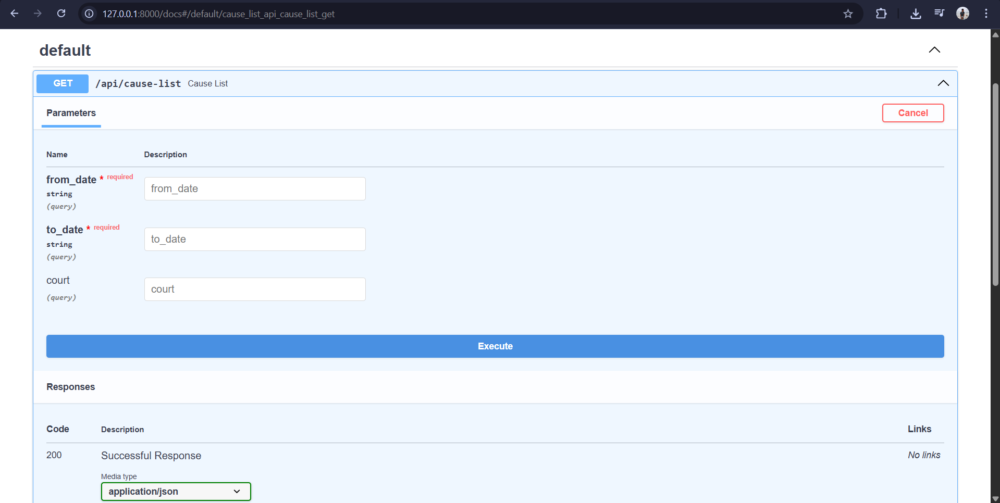
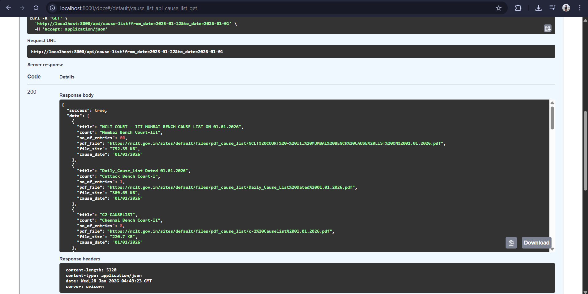
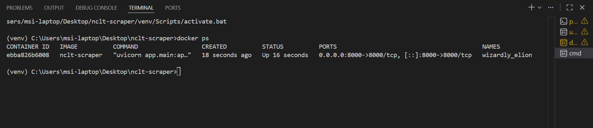

# 🏛️ NCLT Cause List Scraper

A FastAPI-based backend service that scrapes **NCLT (National Company Law Tribunal)** cause list data and returns it in structured JSON format.  
Supports filtering by date range & bench court, handles captcha, and exposes HTTP APIs + Docker support.

---

## ✨ Features

- Scrapes PDF cause list data from `nclt.gov.in`
- Captures:
  - Title
  - Court
  - No. of entries
  - PDF URL
  - File size
  - Cause date
- Captcha handling (math-based)
- Robust retry logic
- Input validation + structured API responses
- Async I/O for non-blocking scraping
- Dockerized runtime
- Unit tests included

---

## 📍 Problem Context

NCLT publishes daily cause lists but only via an unstructured web interface.  
This service automates retrieval into machine-friendly JSON with optional filtering.

---

## 🧱 Architecture

┌─────────────────────────┐
│ FastAPI │
│ (Request Validation) │
└──────────────┬──────────┘
│
▼
┌─────────────────────────┐
│ Service Layer │
│ (Cause List Service) │
└──────────────┬──────────┘
│
▼
┌─────────────────────────┐
│ Scraper Layer │
│ ├─ Session Manager │
│ ├─ Fetch Results │
│ ├─ Parse HTML │
│ └─ Captcha Solver │
└──────────────┬──────────┘
│
▼
┌─────────────────────────┐
│ HTTP + NCLT Web │
└─────────────────────────┘


---

## 🔁 Data Flow Diagram

Client → FastAPI → Service → Scraper → NCLT.gov.in
↓
HTML
↓
Parse & Extract
↓
JSON Response


---

## 🔐 Captcha Strategy

NCLT uses a **simple math captcha** in text form:

"1 + 7 ="


The service extracts operands + operator and computes automatically.  
No manual intervention or LLM required.

---

## 📡 API Usage

### **Endpoint**

GET /api/cause-list


### **Query Parameters**

| Param       | Required | Type   | Example |
|------------|----------|--------|---------|
| from_date  | Yes      | YYYY-MM-DD | `2025-01-01` |
| to_date    | Yes      | YYYY-MM-DD | `2025-01-20` |
| court      | Optional | string | `Mumbai Bench Court-I` |

💻 Run Locally (without Docker)
```bash
python3 -m venv venv
source venv/bin/activate     # Windows: venv\Scripts\activate
pip install -r requirements.txt
uvicorn app.main:app --reload --port 8000
```
Open Swagger UI
```bash
http://localhost:8000/docs
```
### **Example cURL**

```bash
curl "http://localhost:8000/api/cause-list?from_date=2025-01-01&to_date=2025-01-05&court=Mumbai%20Bench%20Court-I"
Example Successful Response
{
  "success": true,
  "data": [
    {
      "title": "Daily Cause List",
      "court": "Mumbai Bench Court-I",
      "no_of_entries": 52,
      "pdf_file": "https://nclt.gov.in/sites/...pdf",
      "file_size": "142 KB",
      "cause_date": "2025-01-02"
    }
  ],
  "total_records": 1,
  "message": "Data fetched successfully"
}
```
🐳 Run with Docker
1. Build
```bash
docker build -t nclt-scraper -f docker/Dockerfile .
```
2. Run
```bash
docker run -p 8000:8000 nclt-scraper
```
3. Open Swagger UI
```bash
http://localhost:8000/docs
```
## 🧪 Tests

Tests included under:

```
/tests
  ├─ test_api.py
  ├─ test_service.py
  ├─ test_parsing.py
  └─ test_captcha.py
```

Run tests:

```bash
pytest -q
```

---

## 📁 Project Structure

```
nclt-scraper/
├─ app/
│  ├─ scraper/
│  ├─ services/
│  ├─ utils/
│  ├─ main.py
│  └─ router.py
├─ docker/
│  └─ Dockerfile
├─ tests/
├─ requirements.txt
└─ README.md
```

---
📸 Screenshots (placeholders)
🔹 Swagger UI


🔹 Sample JSON Output


🔹 Docker Running Container


⚙️ Tech Stack
Python 3.11

FastAPI

HTTPX / Requests

BeautifulSoup4

Pydantic

Docker

Pytest (optional)

🚧 Limitations
Depends on NCLT website availability

Historical scraping limited by website pagination

PDF data is not parsed (links only, no OCR)

Captcha format assumed to remain math-based

🚀 Future Improvements
Async batch scraping

Bench autocomplete endpoint

PDF parsing & text extraction

Redis caching

AI/ML captcha fallback

UI frontend wrapper

Kubernetes deployment target